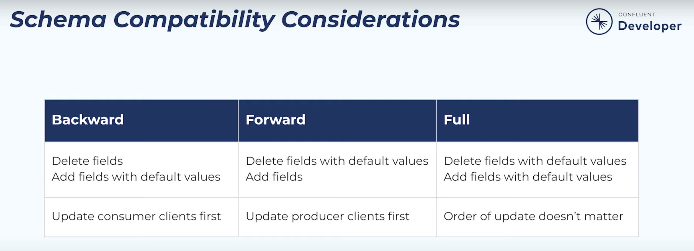

### What is pull queries?
``ksqlDB integrates traditional database-like lookups on top of these materialized tables of data. We’re calling these pull queries as they allow you to pull data at a point in time. In other contexts, this kind of functionality is sometimes referred to as point-in-time queries or queryable state.``

### What is push queries?

``The push queries push out a continual stream of changes, these queries run forever and produce an ongoing feed of results that updates as new changes occur.``

### Examples of pull and push queries

````As an example, consider a ride sharing app. It needs to get a continuous feed of the current position of the driver (a push query), as well as look up the current value of several things such as the price of the ride (a pull query).````

``By default, a query is considered to be a pull query, just as in a normal database. For example, consider the following query:``

~~~~roomsql
SELECT ride_id, current_latitude, current_longitude
FROM ride_locations
WHERE ROWKEY = '6fd0fcdb';
~~~~

| RIDE_ID | CURRENT_LATITUDE | CURRENT_LONGITUDE  |
|---------|------------------|--------------------|
| 45334   | 37.7749          | 122.4194           |

``Note that this is treated as a pull query and returns the current location at the time the query is executed.``

``However, if we append EMIT CHANGES, this will be transformed into a push query that produces a continuously updating stream of current driver position coordinates, not just the current state:``
~~~~roomsql
SELECT ride_id, current_latitude, current_longitude
FROM ride_locations
WHERE ROWKEY = '6fd0fcdb'
EMIT CHANGES;
~~~~
| RIDE_ID | CURRENT_LATITUDE | CURRENT_LONGITUDE |
|---------|------------------|-------------------|
| 45334   | 37.7749          | 122.4194          |
| 45334   | 37.7749          | 122.4192          |
| 45334   | 37.7747          | 122.4190          |
| 45334   | 37.7748          | 122.4188          |

``This allows us to subscribe to the location as it changes and have that stream of values continuously pushed out to the app. ``

### Schema Registry Compatibility
The Confluent Schema Registry default compatibility type `BACKWARD` is non-transitive, which means that it’s not `BACKWARD_TRANSITIVE`. As a result, new schemas are checked for compatibility only against the latest schema. 
These are the compatibility types:

* `BACKWARD`: (default) consumers using the new schema can read data written by producers using the latest registered schema
* `BACKWARD_TRANSITIVE`: consumers using the new schema can read data written by producers using all previously registered schemas
* `FORWARD`: consumers using the latest registered schema can read data written by producers using the new schema
* `FORWARD_TRANSITIVE`: consumers using all previously registered schemas can read data written by producers using the new schema
* `FULL`: the new schema is forward and backward compatible with the latest registered schema
* `FULL_TRANSITIVE`: the new schema is forward and backward compatible with all previously registered schemas
* `NONE`: schema compatibility checks are disabled




